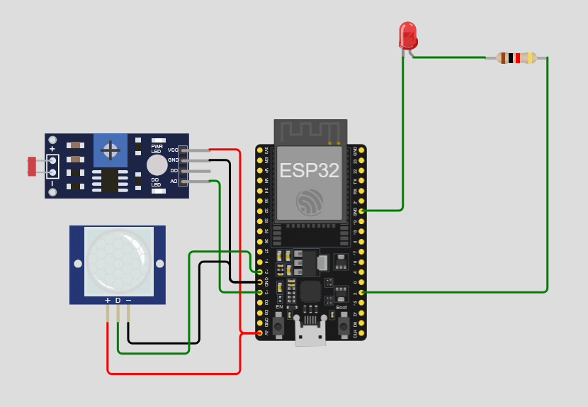

# 🔐💡 Smart Security and Light Control System

[](https://www.espressif.com/en/products/socs/esp32)
[](https://www.arduino.cc/)
[](https://wokwi.com/)
[](https://opensource.org/licenses/MIT)

An intelligent IoT security system that automatically controls lighting based on motion detection and ambient light conditions. This project combines security monitoring with energy-efficient lighting control

## 🌟 Features

- **🚶 Motion Detection**: PIR sensor detects movement in the monitored area
- **🌙 Light-Sensitive Control**: LDR sensor monitors ambient light levels
- **💡 Automatic Lighting**: LED automatically turns on only when motion is detected in dark conditions
- **📊 Real-time Monitoring**: Serial monitor displays sensor readings and system status
- **⚡ Energy Efficient**: Lights only activate when needed (dark + motion detected)
- **🔧 Adjustable Threshold**: Customizable light sensitivity settings

## 🛠️ Hardware Components

| Component | Quantity | Purpose |
|-----------|----------|---------|
| ESP32 DevKit C V4 | 1 | Main microcontroller |
| PIR Motion Sensor | 1 | Detects human movement |
| LDR (Photoresistor) | 1 | Measures ambient light |
| LED (Red) | 1 | Indicator/Security light |
| 1kΩ Resistor | 1 | Current limiting for LED |
| Jumper Wires | Multiple | Connections |

## 📋 Pin Configuration

| Component | ESP32 Pin | Type |
|-----------|-----------|------|
| PIR Sensor (OUT) | GPIO 12 | Digital Input |
| LDR Sensor (AO) | GPIO 13 | Analog Input |
| LED (Anode) | GPIO 2 | Digital Output |
| Power (5V) | 5V | Power Supply |
| Ground | GND | Ground |

## 🔌 Circuit Diagram

The circuit includes:
- **PIR Sensor**: Connected to 5V, GND, and GPIO 12 for motion detection
- **LDR Sensor**: Connected to 5V, GND, and GPIO 13 for light level monitoring
- **LED with Resistor**: Connected to GPIO 2 through a 1kΩ resistor for current limiting



## 💻 Code Structure

The Arduino sketch (`sketch.ino`) implements:

### Key Variables
```cpp
int pirPin = 12;        // PIR sensor pin
int ldrPin = 13;        // LDR sensor pin  
int ledPin = 2;         // LED control pin
int threshold = 500;    // Light threshold (adjustable)
```

### Main Logic
1. **Continuous Monitoring**: Reads both PIR and LDR sensors
2. **Condition Check**: LED activates only when:
   - Ambient light < threshold (dark condition)
   - AND motion is detected
3. **Serial Output**: Real-time sensor data and alerts

## 🚀 How It Works

1. **Standby Mode**: System continuously monitors ambient light and motion
2. **Detection Phase**: When motion is detected, the system checks light levels
3. **Activation**: If it's dark enough (below threshold), the LED turns on
4. **Alert**: Serial message indicates motion detection in dark conditions
5. **Reset**: LED turns off when motion stops or when there's sufficient ambient light

## ⚙️ Installation & Setup

### Prerequisites
- Arduino IDE installed
- ESP32 board package installed in Arduino IDE

### Steps
1. **Clone this repository**
   ```bash
   git clone <repository-url>
   cd Smart_security_and_light_control
   ```

2. **Hardware Setup**
   - Connect components according to the pin configuration table
   - Ensure proper power connections (5V and GND)

3. **Software Setup**
   - Open `sketch.ino` in Arduino IDE
   - Select ESP32 Dev Module as the board
   - Choose the correct COM port
   - Upload the code

4. **Testing**
   - Open Serial Monitor (9600 baud rate)
   - Observe sensor readings
   - Test motion detection in different light conditions

## 🎛️ Configuration

### Adjusting Light Threshold
Modify the `threshold` variable in the code to change sensitivity:
```cpp
int threshold = 500;  // Lower = more sensitive to darkness
```

### Calibration Tips
- **Bright conditions**: LDR values are typically > 800
- **Normal indoor lighting**: LDR values around 400-600
- **Dark conditions**: LDR values < 300
- Adjust threshold based on your environment

## 🔧 Troubleshooting

| Issue | Possible Cause | Solution |
|-------|----------------|----------|
| LED always on | Threshold too high | Lower the threshold value |
| LED never turns on | Threshold too low | Increase the threshold value |
| No motion detection | PIR sensor issue | Check PIR connections and power |
| Inconsistent readings | Loose connections | Verify all wire connections |

## 📱 Simulation

This project can be simulated online using Wokwi:
- **🌐 Live Simulation**: [Wokwi Project Link](https://wokwi.com/projects/435722252656420865)
- **📄 Diagram File**: `diagram.json` contains the complete circuit layout
- **🖼️ Schematic**: `schematic.png` shows the visual circuit diagram

## 🔮 Future Enhancements

- [ ] **WiFi Connectivity**: Send alerts to smartphone
- [ ] **Multiple Zones**: Support for multiple PIR sensors
- [ ] **Time-based Control**: Different sensitivity for day/night
- [ ] **Remote Configuration**: Web interface for threshold adjustment
- [ ] **Data Logging**: Store detection events with timestamps
- [ ] **Integration**: Connect with home automation systems

## 📊 Performance Metrics

- **Response Time**: < 200ms motion detection
- **Power Consumption**: Ultra-low when in standby
- **Detection Range**: Up to 7 meters (PIR dependent)
- **Light Sensitivity**: Configurable threshold

