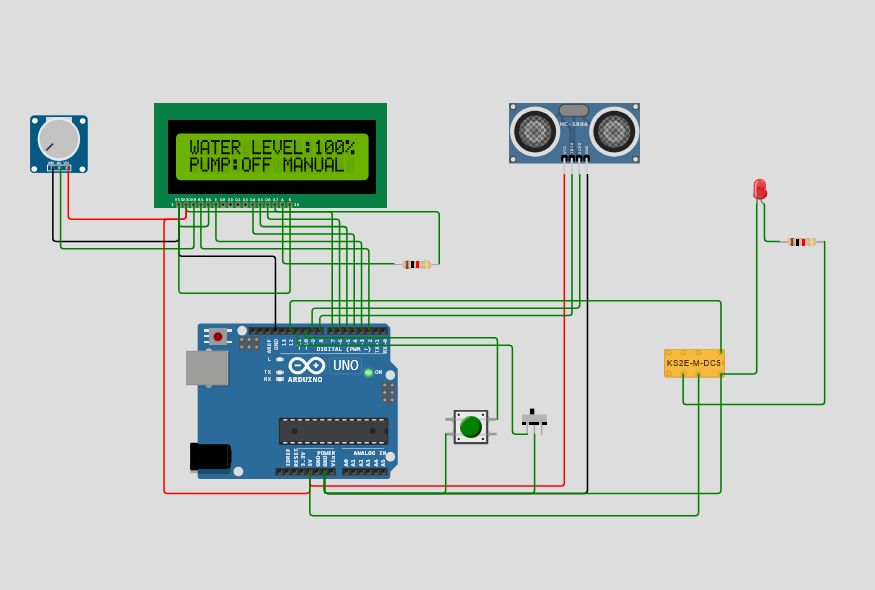

# Automatic Water Level Controller

An Arduino-based automatic water level monitoring and control system designed to maintain optimal water levels in tanks or reservoirs. This project features real-time water level measurement, automatic pump control, manual override capabilities, and a user-friendly LCD display interface.

## 🔍 Overview

This Automatic Water Level Controller is an IoT-based solution that monitors water levels using an ultrasonic sensor and automatically controls a water pump to maintain desired water levels. The system includes both automatic and manual operation modes, making it suitable for various applications such as water tanks, overhead tanks, and irrigation systems.

**Author:** PRANESH S

## ✨ Features

- **Real-time Water Level Monitoring**: Uses HC-SR04 ultrasonic sensor for accurate distance measurement
- **Automatic Pump Control**: Automatically turns pump ON when water level drops below 30% and OFF when tank is full (99%)
- **Manual Override**: Switch between automatic and manual modes
- **LCD Display**: 16x2 LCD shows water level percentage and pump status
- **EEPROM Storage**: Stores calibration settings permanently
- **Manual Calibration**: Set reference water level using push button
- **Visual Indicators**: LED indicators for system status
- **Relay Control**: Safe pump control using relay module

## 🔧 Hardware Components

| Component | Quantity | Description |
|-----------|----------|-------------|
| Arduino Uno | 1 | Main microcontroller |
| HC-SR04 Ultrasonic Sensor | 1 | Water level measurement |
| 16x2 LCD Display | 1 | Display interface |
| Relay Module (5V) | 1 | Pump control |
| Push Button | 1 | Manual calibration |
| Slide Switch | 1 | Auto/Manual mode selection |
| Potentiometer | 1 | LCD contrast adjustment |
| LED | 1 | Status indicator |
| Resistors | 2 | 1kΩ (for LED and pull-up) |
| Jumper Wires | - | Connections |
| Breadboard/PCB | 1 | Circuit assembly |

## 📊 Circuit Diagram

The circuit consists of:
- Arduino Uno as the main controller
- HC-SR04 sensor for water level measurement
- 16x2 LCD for displaying information
- Relay module for pump control
- Control switches and indicators

## 📌 Pin Configuration

| Arduino Pin | Component | Function |
|-------------|-----------|----------|
| Pin 2 | LCD RS | LCD Register Select |
| Pin 3 | LCD Enable | LCD Enable |
| Pin 4 | LCD D4 | LCD Data Pin 4 |
| Pin 5 | LCD D5 | LCD Data Pin 5 |
| Pin 6 | LCD D6 | LCD Data Pin 6 |
| Pin 7 | LCD D7 | LCD Data Pin 7 |
| Pin 8 | HC-SR04 Trig | Ultrasonic Trigger |
| Pin 9 | HC-SR04 Echo | Ultrasonic Echo |
| Pin 10 | Push Button | Calibration Button |
| Pin 11 | Slide Switch | Mode Selection |
| Pin 12 | Relay | Pump Control |
| 5V | VCC | Power Supply |
| GND | Ground | Common Ground |

## 💻 Software Features

### Core Functions:
- **Water Level Calculation**: Converts ultrasonic sensor readings to percentage
- **Automatic Control Logic**: Maintains water level between 30% and 99%
- **Mode Switching**: Toggle between automatic and manual operation
- **Calibration System**: Set reference point for accurate measurements
- **EEPROM Storage**: Persistent storage of calibration data
- **Real-time Display**: Continuous monitoring and status updates

